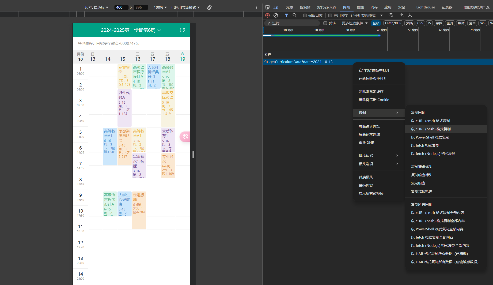

# 介绍
### 这个半自动代码可以帮助你将妮呜WHU的课表导入日历中统一管理

# 需要安装的包
+ icalendar
+ uuid
+ json
+ datetime

### 安装命令：
```
pip3 install icalendar uuid json datetime
```
# cookie和headers的获取
### 用电脑打开[智慧珞珈的手机版](https://zhlj.whu.edu.cn/mobile/curriculum)，登录`zhlj.whu.edu.cn`之后，按`F12`打开开发者控制台，然后切换模拟设备为一台手机，看下面的GIF。


### 网页打开课表页面，任选一周，控制台打开Network（网络）。


### 刷新页面，在控制台找到`getCurriculumData?data=`，右键选择复制为cURL(bash)


### 将其复制到[curlconverter](https://curlconverter.com/python/)得到需要的cookie和headers

# 课表的获取
### 将cookie和headers填入`get_calendar.py`,并运行，得到`calendar.json`

# 日历的生成
### 运行`main.py`，Python版本的话我本地是`3.13.0`，没有测试过其他版本。运行顺利的话会出现`all.ics`这个日历文件，但还需要处理。用文本编辑器打开`head.ics`和`all.ics`，将`all.ics`的这一些内容替换成`head.ics`的所有内容：
```ics
BEGIN:VCALENDAR
VERSION:2.0
X-APPLE-CALENDAR-COLOR:#540EB9
X-WR-CALNAME:生成ics文件测试
X-WR-TIMEZONE:Asia/Shanghai
```
### （幽默果子的日历头部要求极其严格hhh
### 然后，你就可以将更改好的日历文件用Apple设备打开了。理论上所有支持通用日历文件的APP都可以使用。